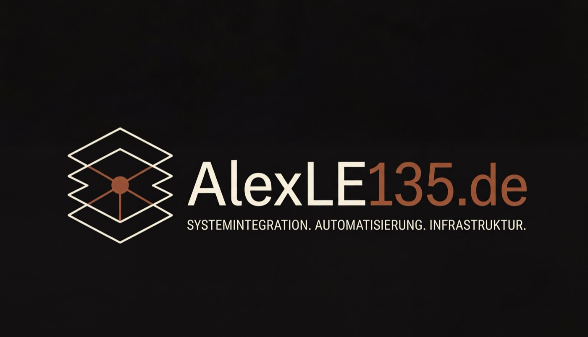

<a href="https://alexle135.de"></a>

---

# homelab

Specs und Runbooks für das eigene Setup: Tailnet, VPS, CachyOS-Desktop,
FritzBox. Teil von [**alexle135.de**](https://alexle135.de) — Markdown
ist Source of Truth, HTML wird parallel gepflegt, Versionierung über
git.

> Wer ich bin und warum es das Repo gibt: [alexle135.de/ueber-mich](https://alexle135.de/ueber-mich)

## Struktur

```
homelab/
├── index.html              Übersicht (HTML-Build der Specs)
├── assets/                 Design-Tokens, CSS, Fonts, Logo
│   ├── colors_and_type.css
│   ├── doc.css
│   ├── logo.jpg
│   └── fonts/
├── specs/                  Markdown + HTML pro Plan
│   └── YYYY-MM-DD-<slug>-design.{md,html}
└── tools/                  Hilfs-Skripte (z. B. Single-File-Build)
```

## Konvention

- Markdown ist Source of Truth. HTML wird daneben gepflegt und spiegelt
  den MD-Stand 1:1.
- Datei-Schema: `YYYY-MM-DD-<slug>-design.md`
- Frontmatter im MD: `title`, `slug`, `version`, `status`, `date`,
  `author`, `scope`, `reading_time`
- HTML referenziert `../assets/colors_and_type.css` und
  `../assets/doc.css` aus `specs/`

## Lokal anzeigen

Statischer Ordner — kein Build, kein Server-Pflicht:

```bash
open index.html              # macOS
```

Für saubere Anker-Links über lokalen HTTP-Server:

```bash
python3 -m http.server 8000  # dann http://localhost:8000
```

## Spec an Kollegen weitergeben (Single-File-HTML)

Für E-Mail-Anhang, Slack-Upload oder USB. Eine Datei, alles inline:

```bash
python3 tools/build-singlefile.py specs/2026-05-20-tailnet-adblock-design.html
# → specs/2026-05-20-tailnet-adblock-design.standalone.html  (~450 KB)
```

CSS und die Geist-Fonts werden base64-eingebettet. Fraunces (Display-Serif)
bleibt über Google-Fonts-CDN bezogen — offline fällt es auf den
Fallback-Stack (Iowan, Palatino, Georgia) zurück. Details in
`tools/README.md`.

Die generierten `*.standalone.html` sind in `.gitignore` und werden
nicht ins Repo committed. Auslieferungs-Stände lieber in einen Ordner
außerhalb des Repos kopieren und mit Datum benennen.

## Aktuelle Specs

| Datum       | Titel                  | Version | Status                 |
|-------------|------------------------|---------|------------------------|
| 2026-05-20  | Tailnet-Werbeblocker   | 0.1.1   | Entwurf                |
| 2026-05-20  | Heim-Monitoring-Stack  | 0.1.1   | Entwurf · Tutor-Modus  |

## Design-System

Stil und Tokens stammen aus der alexle135.de-Designsprache: dark-first
editorial, Fraunces + Geist + Geist Mono, Neon-Orange-Akzent
(`#ff6a00`). Theme-Toggle (dark/light) im HTML-Header.

## Lizenz

- **Doku, HTML, CSS, Diagramme**: [CC BY 4.0](LICENSE) — frei verwendbar
  mit Quellenangabe (Alexander Schneider, https://alexle135.de).
- **Code unter `tools/`**: [MIT](tools/LICENSE).

Wer das Layout oder die Specs übernimmt: kurzer Hinweis auf alexle135.de
reicht.

---

<sub>Alexander Schneider · <a href="https://alexle135.de">alexle135.de</a> · <a href="mailto:schneider@alexle135.de">schneider@alexle135.de</a></sub>
